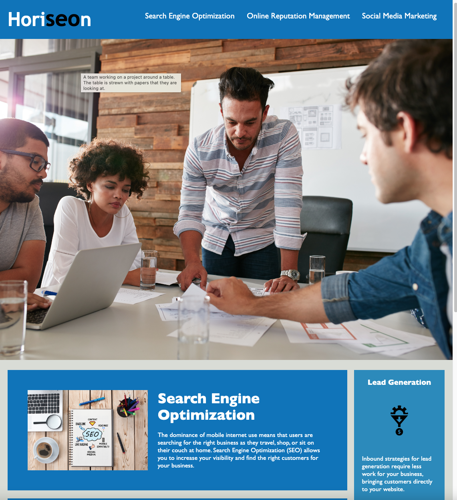

# Bootcamp-Challenge-01_Accessibilty

* In this project, I took an existing webpage and refactored the code to remove redundant classes, as well as add semantic labels to the elements on the page.

* The deployed webpage can be found at: https://brownj47.github.io/Bootcamp-Challenge-01_Accessibilty/

